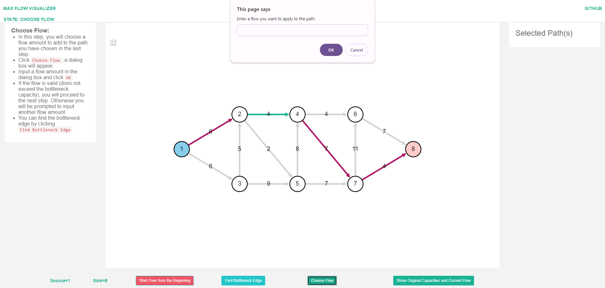

# iFlow

iFlow is an interactive visualizer for the famous [Maximum Flow](https://en.wikipedia.org/wiki/Maximum_flow_problem) and [Minimum Cut](https://en.wikipedia.org/wiki/Minimum_cut) problems. More specifically, it visualizes three algorithms based on augmenting path:
- [The Ford-Fulkerson Algorithm](https://en.wikipedia.org/wiki/Ford%E2%80%93Fulkerson_algorithm)
- [The Edmonds-Karp Algorithm](https://en.wikipedia.org/wiki/Edmonds%E2%80%93Karp_algorithm)
- Their Widest Path Heuristic Version

There are already a few visualizers for the Max-Flow Min-Cut problem, unlike existing visualizations, iFlow is:
- **Interactive**: users are not only "shown" the execution of algorithms, but they get to select their own augmenting path, choose their own flow amount to apply on that path, and complete their own residual graph
- **Designed to facilitate learning**❤️:
  - Narrative, context-sensitive explanations
  - Detailed feedback when users make mistakes
  - The option to automatically complete each step, to be used as a non-interactive visualizer when users do not understand the concepts too well yet, or to accelerate the visualization so that users can focus on other steps when they are already familiar
- **Capable of visualizing Min-Cut**, again both interactively and automatically
- **Convenient**: buttons to toggle current flow/original capacity, change layout, download and upload graph, and restart with the same graph
- **Empirically tested to be effective**

*iFlow was originally developed at the University of Southern California to assist students in an undergraduate algorithms course with ~150 enrollments. It was qualitatively proved to be engaging and useful. Non-trivial revisions were made after the course, to further refine iFlow. For more information such as evidence and design philosophy, please refer to the paper in the **Cite** section.*

## Examples
User creating a flow network:

User selecting an augmenting path containing a backward edge:

User choosing a flow amount to apply on the selected augmenting path:

User updating the residual graph by adding a backward edge and modifying the capacity of an edge along the previously selected augmenting path:

User validating the selected min-cut and shown a detailed error message:

## Acknowledgments
The initial styling and the choice of Cytoscape framework were inspired by [isabek.github.io](https://github.com/isabek/isabek.github.io). We have kept the same vertical layout and Cytoscape's settings for node size, node color, edge size, and edge color. We thank the author for open-sourcing his code.

## Cite
To appear in SIGCSE.

## Contact
For questions, bugs, or feature requests, please use the [Github Issues page](https://github.com/Maxflow-Visualization/iFlow/issues). Otherwise, contact the [iFlow Team](mailto:ymy@apache.org).